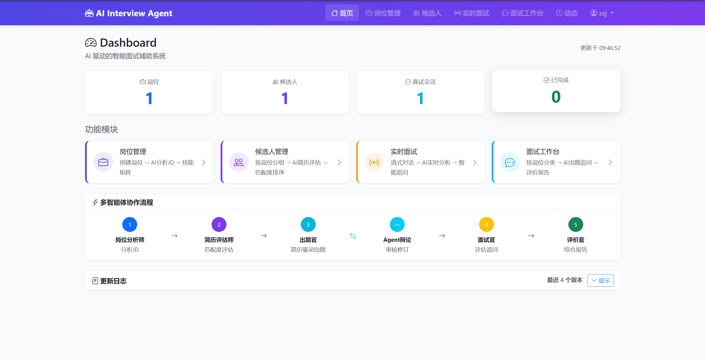
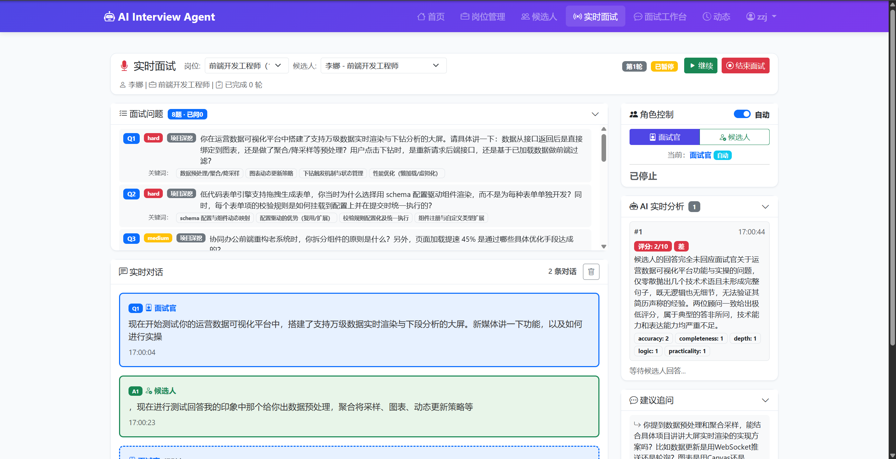
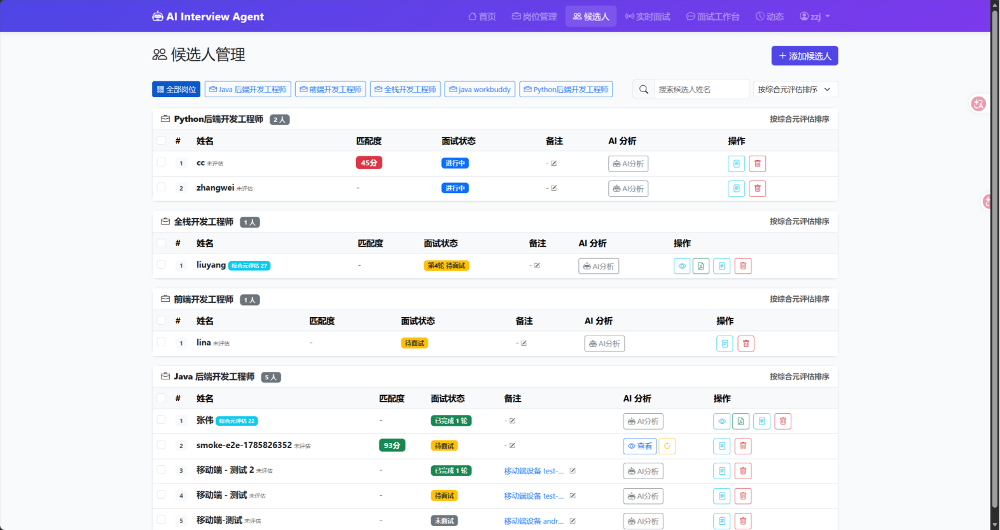
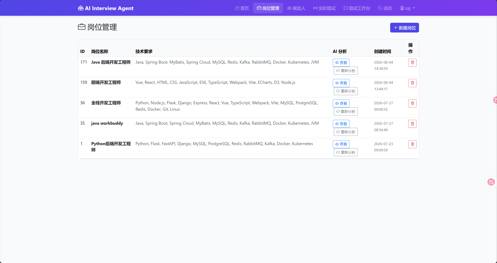

# AI-Interview-Agent

> 多智能体协作 AI 面试助手 · Python + Flask + LLM

## 一句话

给 HR / 面试官用的 AI 面试系统：岗位 JD 解析 → 简历评估 → 智能出题 → 实时面试 → 综合评估报告，全流程多智能体协作。

## 快速开始

```bash
# 1. 复制环境变量模板
cp .env.example .env
# 编辑 .env 填入：LLM API key、讯飞 ASR 密钥、MySQL 配置

# 2. 安装依赖
pip install -r deploy/requirements_full.txt

# 3. 启动
python app.py
# → 访问 http://localhost:8088
# → 默认账号：admin1 ~ admin5 / 密码：123456
```

## 核心功能

| 模块 | 说明 |
|---|---|
| **岗位管理** | 创建岗位、JD PDF 智能解析、AI 技能矩阵 |
| **候选人管理** | 上传简历（PDF/文本）、AI 评估、匹配度排序 |
| **实时面试** | 流式对话、AI 实时分析、追问建议、说话人分离 |
| **面试报告** | 3+1 多智能体评估 + 综合元评估 + PDF 导出 |
| **多账号 + 审计** | 5 个面试官账号、所有操作可追溯 |
| **移动端** | HTTP + WebSocket 两条后端路径（Unity 客户端待开始） |

## 技术栈

| 层 | 技术 |
|---|---|
| 后端 | Flask + waitress（8 worker） |
| 数据库 | MySQL 8 + SQLAlchemy |
| 异步/流 | SSE（Server-Sent Events） |
| 实时通信 | Socket.IO（ASR 流） |
| LLM | DeepSeek / MiniMax（OpenAI 兼容协议） |
| ASR | 讯飞实时转写 |
| TTS | Edge TTS（移动端） |
| 前端 | 原生 HTML/JS + Bootstrap |

## 项目结构

```
AI-Interview-Agent/
├── app.py                 # Flask 应用入口
├── agents/                # 22 个智能体（单文件一 Agent）
├── services/              # 业务服务（编排、LLM、ASR、面试、简历）
├── routes/                # 9 个 Flask 蓝图
├── repositories/          # 数据访问层
├── models/                # SQLAlchemy ORM
├── prompts/               # LLM prompt 模板
├── utils/                 # 工具（PDF、审计、logger）
├── templates/             # Jinja2 HTML 模板
├── static/                # 静态资源
── tests/                 # 单元 + e2e 测试
├── deploy/                # 部署工具链
└── docs/                  # 项目文档
```

## 测试

```bash
# 冒烟测试（87 项，需 LLM 在线）
python smoke_test.py

# 单元测试
python tests/test_extract_score.py
python tests/test_merge_hidden.py

# 移动端 e2e（需 Flask 在跑）
python tests/test_mobile_e2e.py --skip-result
```

## 部署

详见 `deploy/UPLOAD_GUIDE.md`（152 行完整手册）。

```bash
# 本地打包
python deploy/make_deploy_zip.ps1

# 云端部署
bash deploy/install.sh    # 装依赖 + 初始化
bash deploy/start.sh      # 启动
bash deploy/log.sh        # 看日志
```

## 版本历史

| 版本 | 日期 | 关键内容 |
|---|---|---|
| v1.0 | 2026-07-22 | 多智能体架构上线 |
| v2.0 | 2026-07-23 | 综合元评估 + PDF 智能导入 |
| v3.0 | 2026-07-28 | SSE 兜底题修复 + 评分重构 |
| v4.0 | 2026-08-03 | 双流音频 + ASR 说话人分离 |
| v4.4.2 | 2026-08-12 | 出题 SSE 心跳 + 超时保护 |
| 移动端 | 2026-08-14 | HTTP + WebSocket 后端路径 |

详见 `CHANGELOG.md`。

## 文档

| 文件 | 说明 |
|---|---|
| `CHANGELOG.md` | 版本变更日志 |
| `docs/HANDOVER.md` | 项目交接报告（本地，未入库） |
| `docs/HANDOFF_移动端AI面试助手.md` | 移动端交接文档 |
| `deploy/UPLOAD_GUIDE.md` | 云端部署手册 |
| `.env.example` | 环境变量模板 |

## 许可证

私有项目，未公开授权。

## 界面预览

### 候选人管理

按岗位分组展示候选人，支持 AI 评估、匹配度排序、面试状态跟踪。



### 实时面试工作台

面试官与候选人实时对话，AI 实时分析回答质量并给出追问建议。






